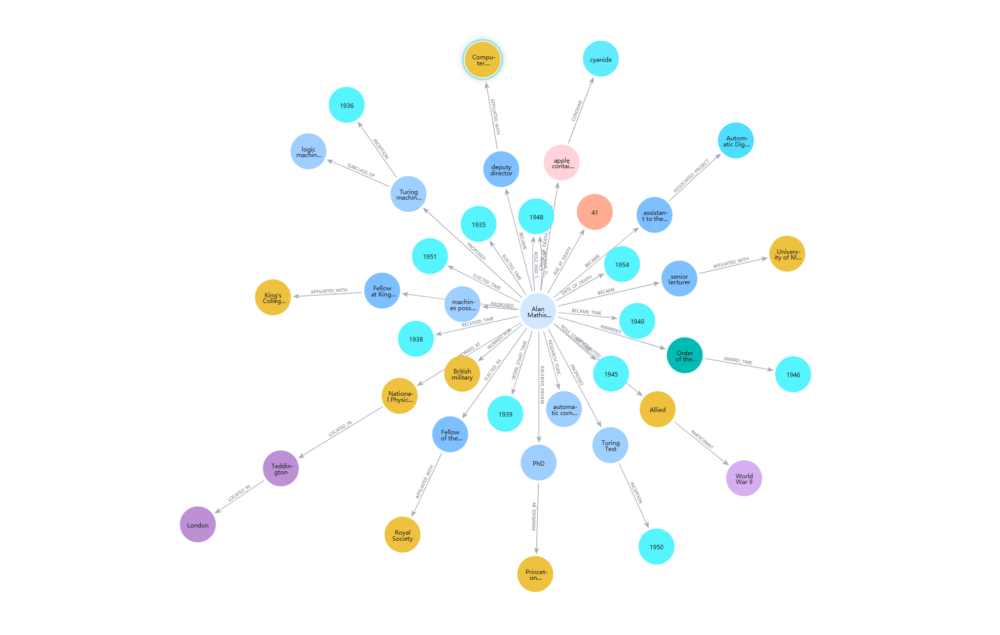

# Turing Knowledge Graph

这是一个用于从普通文本中构建知识图谱的示例项目。输入一段文本后，项目会识别实体、合并别名、做简单消歧，并抽取实体之间的关系，最终输出 JSON 格式的知识图谱。

项目的目标是把原本写在代码里的词典、规则、别名表和知识库拆成配置文件，方便在不同文本领域中复用和调整。

## 运行效果

- 知识图谱 **json** 结果参考[kg_re.json](output/kg_re.json)。
- 知识图谱可视化结果。
  

## 主要能力

- 实体识别：支持规则、词典、CRF 模型和 Hugging Face NER 模型。
- 实体规范化：支持别名合并、称谓剥离和无效片段过滤。
- 实体消歧：结合字符串相似度、上下文和知识库信息进行链接。
- 关系抽取：支持规则抽取，也可以接入预训练关系抽取模型。
- 配置化扩展：大部分领域知识放在 `data/config/` 中，修改配置即可适配新数据。

## 项目结构

```text
.
+-- main.py                  # 构建知识图谱的主入口
+-- train_crf.py             # 训练 CRF 实体识别模型
+-- sample_text.txt          # 示例输入文本
+-- requirements.txt         # Python 依赖
+-- data/
|   +-- sample_general_bio_train.jsonl
|   +-- config/              # 词典、规则、别名表和知识库配置
+-- kg_builder/              # 核心流水线代码
+-- output/                  # 示例输出结果
```

## 安装依赖

建议使用 Python 3.10 或更高版本。

```bash
pip install -r requirements.txt
```

如果只使用默认规则和词典，核心依赖较少；如果要使用 CRF 或 Transformer 模型，需要安装 `requirements.txt` 中的可选模型依赖。

## 快速运行

使用默认配置构建知识图谱：

```bash
python main.py --input sample_text.txt --output output/kg.json
```

输出文件是一个 JSON，主要包含：

- `entities`：识别并规范化后的实体节点
- `relations`：抽取到的关系边
- `metadata`：实体数量、关系数量、标签分布和使用的配置路径

## 使用自定义配置

默认配置目录是 `data/config/`：

```bash
python main.py --input sample_text.txt --output output/kg.json --config-dir data/config
```

也可以只替换某一个配置文件：

```bash
python main.py --input your_text.txt --output output/kg.json --alias-table data/config/alias_table.json --knowledge-base data/config/knowledge_base.json
```

常用配置文件说明：

- `entity_patterns.json`：实体正则规则
- `lexicon.json`：词典匹配表
- `alias_table.json`：别名到标准名的映射
- `knowledge_base.json`：实体消歧用的知识库
- `relation_rules.json`：关系抽取规则
- `normalization.json`：实体清洗、标签映射和过滤规则

## 使用 CRF 模型

先用 BIO 标注数据训练模型：

```bash
python train_crf.py --train data/sample_general_bio_train.jsonl --output models/crf_ner.pkl
```

再在构图时启用 CRF：

```bash
python main.py --input sample_text.txt --output output/kg_crf.json --use-crf --crf-model models/crf_ner.pkl
```

## 使用 Transformer 模型

可以传入本地模型目录，也可以传入 Hugging Face 模型名：

```bash
python main.py --input sample_text.txt --output output/kg_ner.json --transformer-model dslim/bert-base-NER
```

如果模型和 tokenizer 不在同一个目录或仓库，可以单独指定 tokenizer：

```bash
python main.py --input sample_text.txt --output output/kg_ner.json --transformer-model your-model --transformer-tokenizer bert-base-chinese
```

## 使用关系抽取模型

默认关系抽取模式是 `hybrid`，会优先尝试模型，再结合规则。也可以显式指定模型参数：

```bash
python main.py --input sample_text.txt --output output/kg_re.json --relation-extractor transformer --relation-model Babelscape/mrebel-large --relation-source-lang zh_CN --relation-decoder-start-token tp_XX
```

如果只想使用规则关系抽取：

```bash
python main.py --input sample_text.txt --output output/kg_rules.json --relation-extractor rules
```

## 如何适配新领域

通常只需要做三件事：

1. 修改 `data/config/*.json`，补充新领域的实体词典、规则、别名和关系模板。
2. 如果有标注数据，重新训练 CRF 模型。
3. 选择适合该领域的 Transformer NER 或关系抽取模型。

这样可以尽量少改代码，把领域差异集中放在配置和模型中。
